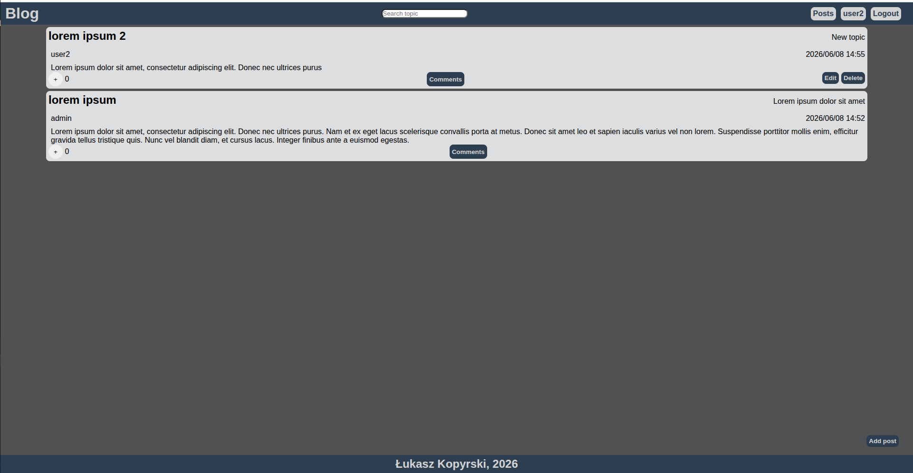
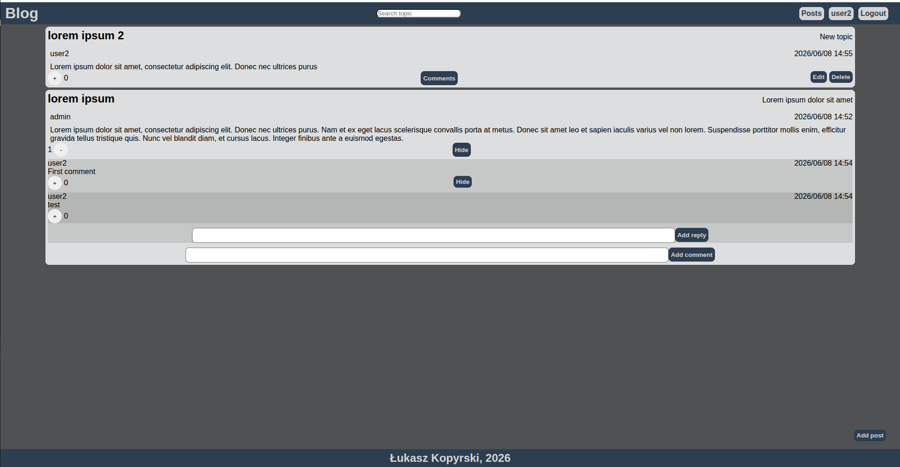
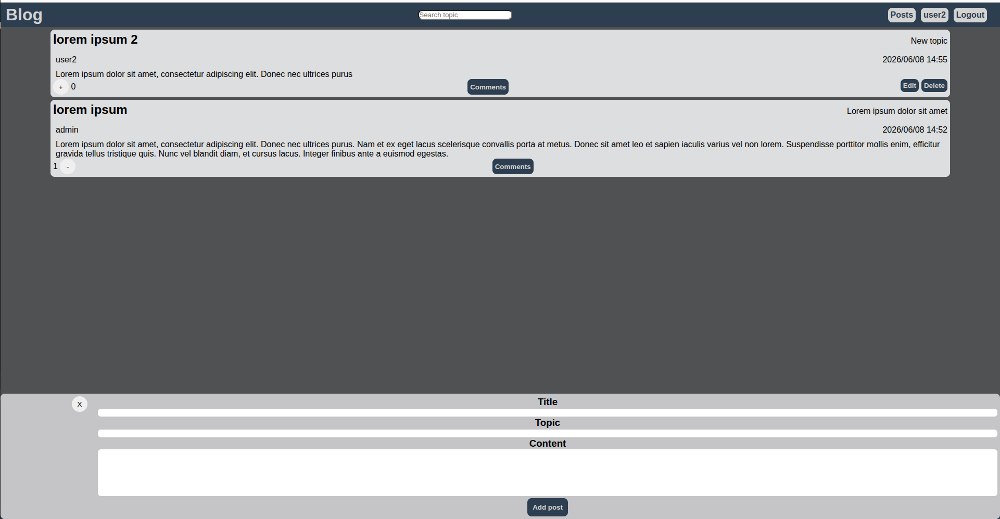
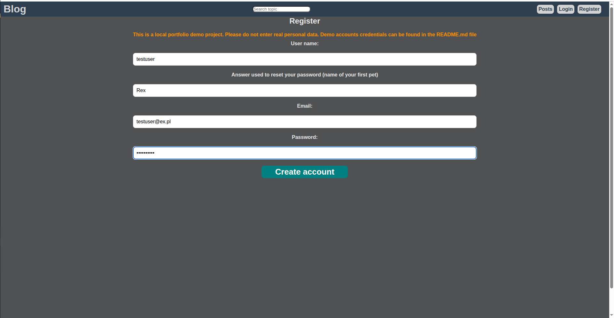
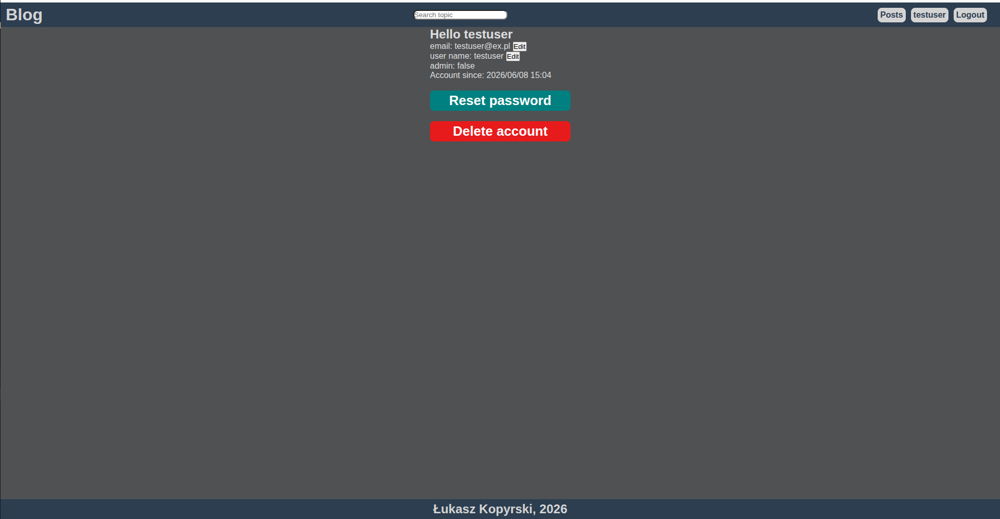
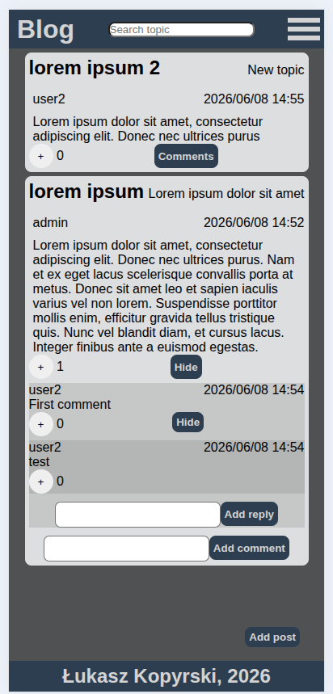

# Blog App

Fullstack webapp built with Vue 3, Django REST Framework

---

# Features

- User registration and login
- JWT httponly authentication system
- Post, comments and replies CRUD
- Score system for post, comments and replies
- Topic filtering
- Demo accounts
- Author/Admin permissions
- RWD
- Dockerized enviroment

---

# Tech Stack

## Frontend
- Vue 3
- Pinia
- Axios

## Backend
- Django
- Django REST Framework
- JWT Authentication

## DevOps
- Docker
- Docker Compose

---

# Run locally

## 1. Clone repository
git clone 
## 2. Enter project directory
cd blog
## 3. Build and run containers
docker compose up --build

---

# Local adresses

Frontend:
http://localhost:8080/
Backend API:
http://localhost:8000

# Endpoints

# Demo Accounts
 Demo accounts are automatically created during aplication startup
## Admin

email: 
admin@ex.com

password:
Qwerty123!

## User 1

email: 
user1@ex.com

password:
Qwerty321!

## User 2

email: 
user2@ex.com

password:
Qwerty111!

## Screenshots

### Home Page

### Post

### Add Post

## Register

## Account 

## Mobile

## Notes

This is a local demo project intended for testing purposes. 

Please do not use real personal information.

All data is stored locally on your machine and is not hosted or transmitted to any external server.

Demo account credentials are available in this README file.

## Author 

Łukasz Kopyrski